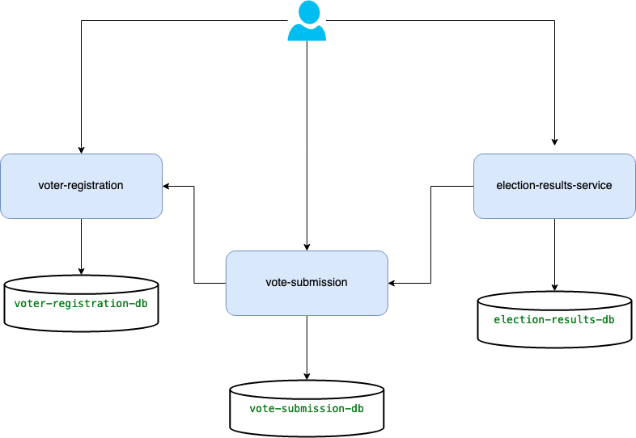

# Voting App Microservices Application deployed on Kubernetes

This project demonstrates the Voting App Microservices Application deployed on Kubernetes.


## Architecture

Voting App consists of 3 microservices written in Java language that talk to each other over REST.



| Service                    | Language |                                                                                                                                     Description                                                                   |
|----------------------------|:--------:|------------------------------------------------------------------------------------------------------------------------------------------------------------------------------------------------------------------:|
| voter-registration-service |   Java   |                                                                                                      Stores the voter registration details like Voter ID, Name, DOB, Address, Phone Number etc. and retrieves it. |
| vote-submission-service    |   Java   | Validates the voter details by calling the voter registration service and then stores the vote submission details like Voter ID, Leader, Party and Vote Type Details. Also retrieves the vote submission details. |
| election-results-service   |   Java   |                    Runs a scheduler job every 30 seconds to call the vote submission service to fetch the submitted vote details and calculate the election results and store it. Retrieves the election results. |


## Deployment

To deploy this project follow the mentioned steps.

### Docker Images

- Build the Docker Images with spring boot maven plugin
   - Go to the voter-registration-service root folder and run the below command
    `./mvnw spring-boot:build-image -DskipTests`
    - Same as previous step for vote-submission-service and election-results-service

- Push Docker images to Docker Hub
    ```
    docker login
    docker push sumitdas28/voter-registration-service:0.0.1-SNAPSHOT
    docker push sumitdas28/vote-submission-service:0.0.1-SNAPSHOT
    docker push sumitdas28/election-results-service:0.0.1-SNAPSHOT
    ```

### Deployment steps for Google Kubernetes Engine (GKE)

- Create GKE standard cluster
- Go to the voter-registration-service root folder and run the below commands to create the deployment.
    ```
    gcloud container clusters get-credentials cluster-1 --zone us-central1-c --project ancient-folio-350713
    kubectl apply -f deployment.yaml
    ```

- Same as previous step for vote-submission-service and election-results-service